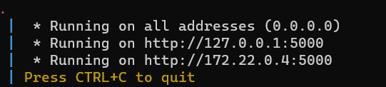

# Projet Powerlifting Data Analysis

## Partie 1: Qu'est-ce que le Powerlifting?

Le powerlifting est un sport de force qui consiste à effectuer trois mouvements principaux : le squat, le développé couché et le soulevé de terre. Les compétiteurs, appelés powerlifters, cherchent à soulever le plus de poids possible dans chacun de ces mouvements. Pour cela, ils ont 3 essaies sur chacun des mouvements et on ne garde que le score le plus élevé. Les athlètes sont séparés en catégories de poids car c'est un sport qui est très lié au poids du corps, une personne très légère aura plus de mal à soulever une charge très lourde.
Lorsque l'on souhaite comparer des athlètes entre catégories de poids, en genre. Les performances des athlètes sont alors évaluées en utilisant une métrique appelée "dots" ou "goodlift". Cette mesure prend en compte la catégorie de poids, le total soulevé et le genre de la personne pour évaluer la performance globale.

## Partie 2: Collecte de données depuis OpenPowerlifting

Nous avons récupéré nos données à partir du site [OpenPowerlifting](https://www.openpowerlifting.org/), qui est une plateforme classant les athlètes de powerlifting en fonction de leurs performances évaluées en dots. Ces données sont précieuses pour l'analyse du powerlifting et peuvent fournir des informations intéressantes sur les tendances, les athlètes exceptionnels, ...
Voici à quoi ressemble le site internet : 

## Partie 3: Docker Compose

Nous avons créé un environnement Docker avec Docker Compose pour simplifier le déploiement et l'exécution de notre projet. L'environnement Docker se compose de trois conteneurs distincts :

## Voici la sctucture du projet qui à été utulisée : 

### 1. **Scrapy Container :**
- Utilisé pour exécuter notre script Scrapy qui collecte les données depuis OpenPowerlifting. Dans le Dockerfile, on désigne le python que l'on souhaite utiliser.
  Ensuite, on exécute une commande pour installer les dépendances ("requirements.txt"). Puis ensuite on exécute une commande qui lance le programme de scrapping.

## 1.1. Définition du spider Scrapy :
- OpenPowerliftingSpider est la classe principale du spider.
- name : Nom du spider.
- allowed_domains : Domaine autorisé pour la collecte.

## 1.2. Méthodes du spider :
- __init__ : Initialisation du spider avec une liste vide data_frames pour stocker les DataFrames à chaque itération.
- from_crawler : Méthode de classe pour connecter un signal lorsque le spider est fermé.
- start_requests : Méthode pour générer les requêtes de départ avec une boucle pour collecter des données par lots.
- parse : Méthode pour extraire les données pertinentes, créer un DataFrame et effectuer des conversions de données.
- spider_closed : Méthode déclenchée lorsque le spider est fermé, connectée au signal.

## 1.3. Collecte de données :
- Le script envoie des requêtes au site OpenPowerlifting pour récupérer les classements par lots.
- Les données sont extraites du JSON de réponse, et seules certaines colonnes sont sélectionnées.
- Les données sont ensuite converties et nettoyées, prêtes à être stockées dans MongoDB.

## 1.4. MongoDB : 

- Le script utilise le module pymongo pour se connecter à une instance MongoDB (dans un conteneur Docker).
- Les données nettoyées sont insérées dans une collection MongoDB.

## 1.5. Réacteur Twisted :
Le script utilise le réacteur Twisted pour gérer les opérations asynchrones de Scrapy.
Il arrête le réacteur lorsque la méthode spider_closed est appelée.

2. **Mongo Container :**
- Contient une instance de MongoDB pour stocker les données collectées. Une fois que l'on a scrappé les données avec Scrapy, elles sont mises dans la base de données mongo qui est très bien lorsqu'on posséde beaucoup de données. Ici, dans ce dataset, nous avons plus de 481 000 lignes et nous avons décidé de sélectionner seulement une dizaine de paramètres.

3. **API Flask Container :**
- Héberge une application Flask qui expose une API pour interagir avec les données stockées dans MongoDB. Nous avons fait une application Flask qui est exécuté une fois que les données scrappées ont étés récupérées. Dessus on peut y voir plusieurs graphiques dessus.

L'application Flask qui se connecte à une base de données MongoDB, récupère des données sur les participants au powerlifting, effectue des agrégations MongoDB pour générer des statistiques, puis crée et affiche des graphiques basés sur ces statistiques.

## 3.1. Importation des modules :
- Importation des modules nécéssaire à la création de notre application Flask, la manipulation des données dans notre base de données mongo puis à la génération de graphiques avec matplotlib.

## 3.2. Connexion à la base de données MongoDB :
- Établit une connexion à la base de données MongoDB nommée "Powerlifting" et à la collection "power" contenant les données des participants au powerlifting.

## 3.2. Fonction pour générer les graphiques :
- Utilise des pipelines d'agrégation MongoDB pour extraire des statistiques utiles.
- Crée plusieurs graphiques à l'aide de Matplotlib en utilisant ces statistiques.
- Enregistre les graphiques dans un objet BytesIO, les convertit en base64 et renvoie la chaîne pour l'affichage dans HTML.

## 3.3. Route pricipale Flask :
- Définit une route principale ("/") qui déclenche l'exécution de la fonction generate_graphs.
- Transmet les graphiques générés à un modèle HTML (index.html) via la fonction render_template.

## 3.4. Exécution de l'application :
- Exécute l'application Flask en mode débogage, permettant un accès depuis d'autres appareils sur le réseau.

## Partie 4: Ce qu'on voit sur les différents graphiques : 
- Les deux premiers graphiques montrent la répartition des poids des hommes et des femmes dans différentes catégories de poids. En effet, c'est un sport dont les performances dépendent énormément du poids des partcipants. C'est pourquoi il a été extrèmement important de définir des catégories de poids ainsi que de séparer les hommes et les femmes.

- Après, dans le graphique 'Camembert' on peut voir que 3/4 des participants aux compétitions sont des hommes. C'est un sport très masculin mais de plus en plus de femmes se mettent au POwerlifting. 

- On peut voir, sur l'histogram suivant que c'est un sport qui est pratiqué majoritairement par une catégorie de personnes assez jeunes. Une grande partie des participants ont moins de 30 ans.

- Sur le dernier graphique on peut voir que le nombre de participants aux compétions est croissant. On peut également voir que le covid à eu un impact majeur sur les compétions de Powerlifting. De plus, chaque personne n'apparait qu'une seule fois dans dans le "tableau". On garde le meilleur score de chacun, donc on peut aussi voir que les performances s'améliorent d'années en années. C'est pour cela que les records du monde en Powerlifting sont battus très régulièrement. 

Voici à quoi ressemble l'application : 

## Partie 5: Comment lancer le docker-compose 

Il suffit de se placer dans le répertoire du docker-compose là où il y a le fichier 'docker-compose.yml'.
Puis lancer la commande : 'docker-compose up --build'. 
Pour finir, il vous suffira de sélectionner le premier lien 'http' présent : 

## Partie 6: Conclusion 

Le projet Powerlifting Data Analysis utilise Scrapy pour collecter des données depuis OpenPowerlifting, les stocke dans MongoDB et présente des statistiques visuelles avec une application Flask. Les graphiques générés révèlent des tendances clés, notamment la prédominance masculine, la distribution des âges, et la croissance continue du nombre de participants. Cette analyse offre un aperçu informatif du powerlifting, illustrant son évolution et ses caractéristiques démographiques, tout en démontrant l'efficacité de l'intégration de Scrapy, MongoDB et Flask dans un environnement Dockerisé.

---

Ressources :
 - Dockerfile : https://openclassrooms.com/fr/courses/2035766-optimisez-votre-deploiement-en-creant-des-conteneurs-avec-docker/6211517-creez-votre-premier-dockerfile
 - Docker-compose : https://datascientest.com/docker-compose-tout-savoir
 - Scrapy : https://datascientest.com/en/scrapy-everything-you-need-to-know-about-this-python-web-scraping-tool
 - flask : https://flask.palletsprojects.com/en/3.0.x/
 - css : https://pythonhow.com/python-tutorial/flask/Adding-CSS-styling-to-your-website/
 - mongoDB : https://ressources.magicmakers.fr/ressource-python-webapp-requetes-mongodb/
 - + le cours évidemment 

**Remarque :** Pour utiliser ce projet, assurez-vous d'avoir installé Docker, Docker Compose sur votre machine. Vous pouvez construire et exécuter l'environnement Docker en utilisant les commandes appropriées.
